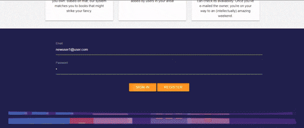

# It's Lit!

## What is it?
It's Lit is a web application that facilitates local person-to-person book lending. As part of the registration process, users input their genre preferences. When they log on, the app then searches through its database and recommends books it believes the user will enjoy based on category. It's Lit provides not only the title and author for each recommended title but also a short synposis and an image of its cover. 

Once the user finds a book they would like to borrow, they select that title and It's Lit displays the distance from that book's owner to the user as well as the contact information for the owner so that a "lending meetup" can be arranged. If users want to branch out and browse It's Lit's entire collection of books, they can search by category or check out the "All Books" tab. 
 

## Why did we create such a thing? 
So many reasons but I'll just name a few: 
* To encourage people to get back in to reading paperback books 
	* I mean, in this digital age, how many people actually take the time to escape the real world and dive into a literary one? To be regularly missing out on the stress-reduction that comes with reading books - this is certainly a problem that needs solving. 
* To make it easy for readers to broaden their horizons 
	* With a user-fueled library, readers can find titles here that they may not find anywhere else making it easy for them to try out something new. 
* To widen people's social circles
	* We couldn't help but think: if you were to bond with someone over the same nerdy book you've both read, couldn't that be the start of a beautiful friendship? How great would it be to create something that contributed to that!

## How did we make it? 
When users signup, they submit a list of books they would be willing to lend, providing the title, author and genre. These books are then stored in a MySQL database (we used Sequelize ORM to perform CRUD tasks). Later on, when a user logs in, a GET request is used to query the database, sending back all books that meet that particular user's genre preferences and have a status of "checked in". The titles of those books are submitted as part of the query that hits the Google Books API which allows us to display each book's synopsis and cover image. To display the distance from the book's owner to the user, we utilized Google's Distance Matrix API. The entire project was created using RESTful standards.  

## Where do we go from here?
Here are our ideas for future development! We would love to. . .
* Create a forum 
	* So that people can dish about their favorite books and really establish a sense of community on the site
* Add direct messenging 
	* Allowing users to talk to one another directly through the site and making it more convenient to set up "lending meetups"
*	Handle multiple copies more efficiently
	* That is to say, if multiple owners have the book a user has selected, It's Lit will display the results in order of distance to the user. 

## Whose cool idea is this?
A very awesome team consisting of: 
* Stacy J.P.
* Elisheva Elbaz
* Nathan Coder
* Erin Rizal 
